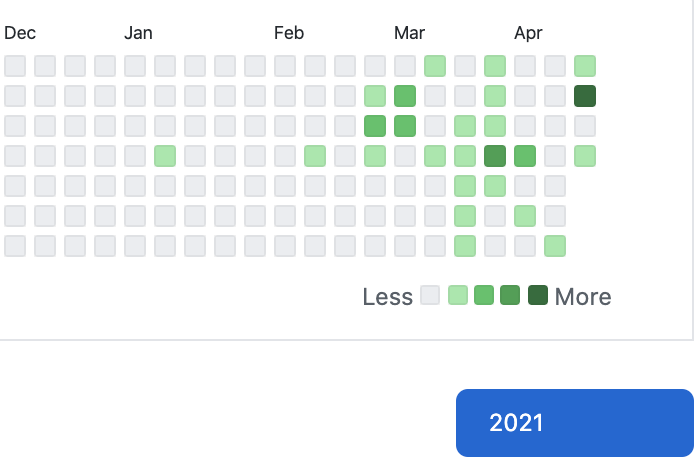

## 伝えたいこと

- [@mini_hiori](https://twitter.com/mini_hiori)にて、プログラミングそのほかの内容も呟くようになります
- 別に作曲とか音ゲーやめるわけではないです
- 人と話したくなってきたので、気軽にリプとかDMとか電話とかしてください(奥手)

## 背景とか動機とか

- 1ヵ月エンジニア専用アカウント([@mini_koharu](https://twitter.com/mini_koharu))作って運用してみたけど、そこまでツイートしなかった
    - 開発をしてないわけではない。良くも悪くもデカいアカウントの使い方を学んでしまって、数年前みたいになんでもかんでもツイートしなくなったというだけ(良い点も悪い点もある)
        - 要は #駆け出しエンジニアと繋がりたい みたいなのを臆面もなくツイートするメンタルはもうないなあ…という気持ち
    - 逆に、フォロワーが少ない状態でもツイートができたことで、エンジニア人格の統合によってリムられが発生してもまあ別にいいかなと思えるようになった
        - 勉強会とかカンファレンス参加したらやかましくなるかもしれないけどそのときだけは勘弁してください…
- 「よく生きる」というのを効率よくやるために、使えるリソースはできるだけ使った方がいい気がしてきた
    - デカいアカウントはそのリソースの一部。音楽の実績もその一部、これから作るエンジニアリングの実績もその一部
    - 人間というのは単一の側面だけでできているものではない気がする。それぞれの側面で人格を分離するようなことは非効率な気がする。全部ひっくるめて「こんな人もいるんだな〜」的な見方をしてもらう方がうれしいかもしれない
        - アーティスト然と振舞うことがどうしてもできなかった、というのの裏返しでもある
- これからの生き方として、できる範囲で自分のアクティビティをオープンにしたり、他人と関わるということをやっていきたい
    - その方が人生が楽しくなりそう。人とのつながりは多い方がいいということにやっと気が付いた
        - 今までかなり人間関係をバサバサやってきたが(今までリアルで知り合ってくれた各位本当に申し訳ない)、今後はできるだけやめたい
    - 今まで良くない行動をとったことがあるし、これからも良くない行動をとることはあると思う。オープンであるということはその責任を取るということである
        - そういう時はきちんと説明をすることで自分や周囲を納得させることができると思う。そのようにありたいと思う。この記事もその説明の一部
    - 話してやってもいいぞという人は気軽に誘ってください
- 作曲とか音ゲーは楽しいのでやります
    - 何につけても楽しいからやるというのが大事 つまんなくなったら潔く次に行こう程度の軽い気持ちでやる

## アカウント分けてやってたこと

- [技術記事クソ書いた](https://zenn.dev/mini_hiori)
    - 最初の1記事書くのは流石に緊張したけど、qiita含め足掛け5記事書いて多少は慣れたかも
- [草が生えてきた](https://github.com/mini-hiori)
    
    - まあ草はいつかは途切れるのであんまり重視してもいけないなとは思うけど、やったなあとは思えるので精神衛生上良い